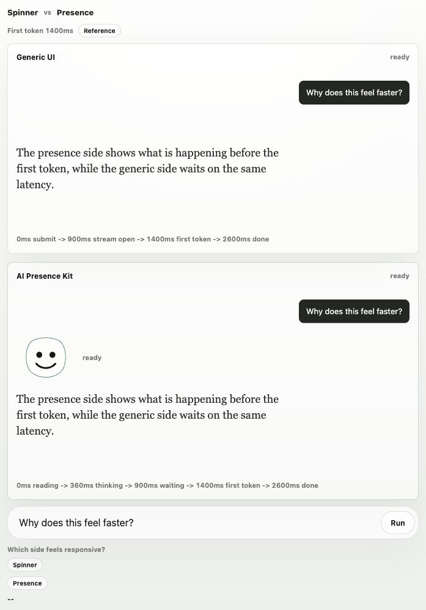
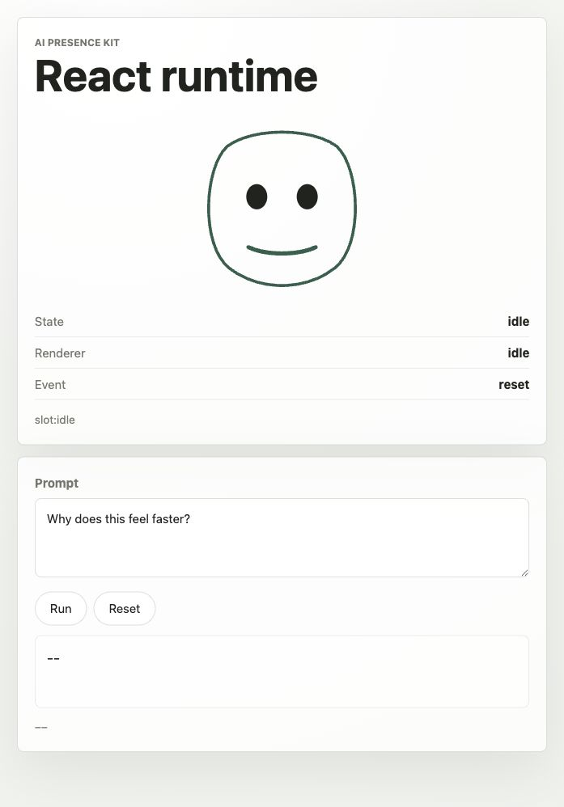

# AI Presence Kit

AI Presence Kit is a low-latency facial presence engine for AI interfaces. It turns runtime signals like typing, pausing, waiting, thinking, streaming, speaking, interruption, and error into parallel facial micro-decisions.

The simple SVG face in this repo is the proof surface. It exists to prove that gaze, blink, brows, mouth, posture, and motion can make an AI interface feel attentive before, during, and after model output.

## Question

Can an AI interface make many small facial movement decisions from runtime state quickly enough that it feels co-present before the model responds?

## Goal Statement

Build a minimal, artful facial presence engine for expressive AI interaction: a low-latency web prototype that maps input, response, voice, and latency signals into a conservative presence state model, then lets independent facial controllers make parallel micro-decisions for gaze, blink, brows, mouth, posture, and motion.

The finished prototype should feel less like an avatar and more like a living interface: attentive before it speaks, elegant when idle, responsive under pressure, coherent without pose swaps, and adjustable in expressiveness without pretending to infer private emotion.

## Product Direction

The GitHub-facing package should be framed around facial presence primitives, not a static avatar library:

- `@ai-presence/core`: presence state machine and event model.
- `@ai-presence/react`: React hooks and components for AI apps.
- `@ai-presence/face`: default SVG reference face and facial micro-controller proof.
- `@ai-presence/adapters`: optional adapters for common AI runtimes.

The default face should remain charming and immediately legible, but it should increasingly be driven by independent micro-decisions instead of expression pose swaps. The shared state contract starts with:

```text
idle
user-typing
reading
waiting
thinking
streaming
speaking
interrupted
ready
error
```

This repo now starts that split with a small browser-safe core runtime at:

```text
packages/core/src/presence-core.js
```

The prototype loads that core runtime first, then lets the SVG face interpret the canonical state as a renderer-specific expression. In the metrics panel, `Presence state` is the package-facing state contract; `Renderer` is the face's current expression.
Core also exposes a small transition trace primitive so integrations can inspect what happened before the first visible token.

The shortest pitch:

```text
Replace spinners with presence.
```

The differentiating wedge:

- Static avatar libraries give an agent identity.
- Character and lip-sync tools animate rendered characters, especially while speaking.
- AI chat frameworks build threads, messages, tools, composers, and streams.
- AI Presence Kit sits in the missing middle: it turns runtime state into human-readable interface presence.

It is not emotion recognition. It should express interaction posture: reading, waiting, thinking, streaming, speaking, interrupted, ready, or error.

See `docs/GOAL_LOOP.md` for the active build loop and next milestones.

## Demo



The comparison harness runs the same simulated latency on both sides. The generic UI shows loading until the stream begins; the presence side exposes `reading`, `thinking`, and `waiting` before the first visible token. The route also records DOM timing evidence: `data-generic-first-token-ms="1400"`, `data-presence-first-state-ms="0"`, `data-presence-frame-before-token-ms="0"`, and `data-presence-decision-trace-lead-ms="1400"`.



The React browser demo runs the provider, snapshot hook, renderer slot, adapter path, and face expression mapping with actual React and ReactDOM. The actual renderer slot exposes six-channel trace DOM evidence: `data-face-decision-trace="complete"`, `data-face-decision-trace-channels="gaze blink brows mouth posture motion"`, `data-face-decision-trace-decisions="6"`, `data-face-decision-trace-warnings="0"`, `data-face-decision-trace-renderer-safe="true"`, and `data-face-latency-phase="before-output"` during the pre-output turn.

## Package Shape

Current prototype packages:

```text
packages/core/src/presence-core.js
packages/core/dist/index.mjs
packages/face/src/presence-face.js
packages/face/dist/index.mjs
packages/adapters/src/runtime-adapter.js
packages/adapters/dist/index.mjs
packages/react/src/presence-react.js
packages/react/dist/index.mjs
examples/react-browser.html
```

Each package now has a local npm-style manifest, TypeScript declarations, and dual package entrypoints:

```text
packages/core/package.json
packages/core/src/presence-core.d.ts
packages/face/package.json
packages/face/src/presence-face.d.ts
packages/adapters/package.json
packages/adapters/src/runtime-adapter.d.ts
packages/react/package.json
packages/react/src/presence-react.d.ts
```

Node/CommonJS consumers can use `require`. ESM consumers can import from the package export map:

```js
import { PresenceEvent, createPresenceRuntime } from "@ai-presence/core";
import { createVercelAISDKAdapter } from "@ai-presence/adapters";
import { faceExpressionForPresence, renderPresenceFaceSvg } from "@ai-presence/face";
import { createPresenceReactBindings } from "@ai-presence/react";

const presence = createPresenceRuntime();
presence.send(PresenceEvent.SUBMIT);

const expression = faceExpressionForPresence(presence.getSnapshot());
const renderedFace = renderPresenceFaceSvg(presence.getSnapshot(), { timeMs: Date.now() });
console.log(renderedFace.decisionTrace.decisionCount); // 6
console.log(renderedFace.attributes.decisionTrace); // "complete"
```

Trace usage:

```js
import { PresenceEvent, createPresenceRuntime, createPresenceTrace } from "@ai-presence/core";

const trace = createPresenceTrace({ limit: 32 });
const presence = createPresenceRuntime();
trace.attach(presence);

presence.send(PresenceEvent.SUBMIT);
presence.send(PresenceEvent.STREAM_OPEN);
presence.send(PresenceEvent.TOKEN);

console.log(trace.getEntries().map((entry) => entry.state));
```

Intended public packages:

```text
@ai-presence/core
@ai-presence/react
@ai-presence/face
@ai-presence/adapters
```

Minimal core usage:

```js
const presence = AIPresenceCore.createPresenceRuntime();

presence.send(AIPresenceCore.PresenceEvent.USER_INPUT, { text: "What should I build" });
presence.send(AIPresenceCore.PresenceEvent.USER_PAUSE, { text: "What should I build", completion: 0.4 });
presence.send(AIPresenceCore.PresenceEvent.SUBMIT);
presence.send(AIPresenceCore.PresenceEvent.TOKEN);

console.log(presence.getSnapshot().state);
```

Adapter usage:

```js
const adapter = AIPresenceAdapters.createRuntimeSignalAdapter(presence);

adapter.send({ type: AIPresenceAdapters.RuntimeSignal.STREAM_OPEN });
adapter.send({ type: AIPresenceAdapters.RuntimeSignal.TOKEN });
adapter.send({ type: AIPresenceAdapters.RuntimeSignal.RESPONSE_COMPLETE });
```

Framework adapter usage:

```js
const aiSdkPresence = AIPresenceAdapters.createVercelAISDKAdapter(presence);

aiSdkPresence.update({ status: "submitted" });
aiSdkPresence.update({ status: "streaming", messages: [] });
aiSdkPresence.update({
  status: "streaming",
  messages: [{ role: "assistant", parts: [{ type: "text", text: "Hello" }] }],
});
aiSdkPresence.onFinish({ finishReason: "stop" });
```

Realtime adapter usage:

```js
const realtimePresence = AIPresenceAdapters.createOpenAIRealtimeAdapter(presence);

realtimePresence.handleEvent({ type: "input_audio_buffer.speech_started" });
realtimePresence.handleEvent({ type: "response.output_audio.delta" });
realtimePresence.handleEvent({ type: "response.done" });
```

React binding usage:

```js
const {
  PresenceProvider,
  PresenceRenderer,
  usePresenceFrameTime,
  usePresenceSnapshot,
} = AIPresenceReact.createPresenceReactBindings(React);
```

`usePresenceFrameTime()` gives React renderers a small live millisecond clock. It is renderer-agnostic: a face, badge, waveform, or other surface can use it to advance temporal frames between presence state transitions.

Reference renderer usage:

```js
const expression = AIPresenceFace.faceExpressionForPresence(presence.getSnapshot());
```

## Setup

Server-backed web prototype:

- `index.html`
- `styles.css`
- `app.js`
- `packages/core/src/presence-core.js`
- `packages/face/src/presence-face.js`
- `packages/adapters/src/runtime-adapter.js`
- `packages/react/src/presence-react.js`
- `packages/*/package.json`
- `packages/*/src/*.d.ts`
- `packages/*/dist/index.mjs`
- `server.mjs`
- `.env.example`
- `FACIAL_EXPRESSION_RESEARCH.md`

Run from this folder:

```bash
npm install
cp .env.example .env
# edit .env and set OPENAI_API_KEY
node server.mjs
```

Then open:

```text
http://127.0.0.1:8058
```

Useful local checks:

```bash
npm run validate
```

Individual validation steps:

```bash
npm run check
npm run perf:face
npm test
npm run demo:adapters
npm run demo:react
npm run pack:dry-run
```

`npm run demo:adapters` prints Vercel AI SDK, OpenAI Realtime, and generic chat transitions with reference face frame evidence plus bounded six-channel decision-trace evidence such as `trace=complete`, `decisions=6`, `safe=true`, and `warnings=0`.

`npm run perf:face` runs a local package-level smoke benchmark for the face controller pipeline. It creates shared presence snapshots across all canonical states, calls `faceControllerFrameForPresence`, derives `faceControllerDecisionTraceForFrame`, and fails if the complete six-channel renderer-safe trace exceeds the conservative `0.25ms` average frame+trace budget. This is local face-pipeline evidence, not a browser latency probe, OpenAI call, or release-blocking CI gate.

Adapter source assumptions are tracked in `packages/adapters/README.md`.
Release-readiness gates are tracked in `docs/RELEASE_READINESS.md`.
Versioning, changelog, and npm package-name policy are tracked in `docs/RELEASE_POLICY.md`.

The app can still be opened directly as a static file, but OpenAI-backed speculation, streaming responses, and speech require `server.mjs`.

For visual QA without touching the default first screen, the app accepts quiet view-only query params:

```text
http://127.0.0.1:8058/?metrics=1&presence=expressive
```

These only set the initial metrics visibility and presence level; they do not send text or trigger OpenAI calls.

The A/B comparison harness is available at:

```text
http://127.0.0.1:8058/?compare=1&autorunCompare=1
```

It runs the same simulated first-token latency on both sides; the presence side exposes state, frame, and decision-trace evidence before the first token while the generic side stays in a loading posture. The DOM dataset records the `1400ms` first-token latency and the `0ms` presence-before-output lead edge.

The browser React demo is available at:

```text
http://127.0.0.1:8058/examples/react-browser.html
```

It uses the installed React and ReactDOM UMD builds, then drives `@ai-presence/react`, `@ai-presence/adapters`, and the reference face mapping in a real rendered React tree. Browser smoke should click Run and confirm the renderer slot reports `state=waiting`, `data-face-latency-phase="before-output"`, complete six-channel decision-trace evidence, 6 decisions, 0 warnings, and `data-face-decision-trace-renderer-safe="true"` before output appears.

Expected `.env` keys:

```bash
OPENAI_API_KEY=
OPENAI_MODEL=gpt-5.4-mini
OPENAI_SPECULATE_MODEL=gpt-5.4-nano
OPENAI_RESPONSE_REASONING_EFFORT=none
OPENAI_SPECULATE_REASONING_EFFORT=none
OPENAI_TEXT_VERBOSITY=low
OPENAI_RESPONSE_MAX_OUTPUT_TOKENS=260
OPENAI_SPECULATE_MAX_OUTPUT_TOKENS=120
OPENAI_REALTIME_MODEL=gpt-realtime-2
OPENAI_REALTIME_VOICE=marin
OPENAI_REALTIME_CALL_TIMEOUT_MS=14000
OPENAI_TTS_MODEL=gpt-4o-mini-tts
OPENAI_TTS_VOICE=marin
OPENAI_TTS_FORMAT=wav
PORT=8058
```

Default rationale:

- `OPENAI_SPECULATE_MODEL=gpt-5.4-nano`: speed- and cost-sensitive classification-style work while the user is typing.
- `OPENAI_MODEL=gpt-5.4-mini`: lower-latency final responses without paying flagship-model cost on every turn.
- `OPENAI_*_REASONING_EFFORT=none`: lowest-latency setting for these short, non-tool, UI-facing turns.
- `OPENAI_TEXT_VERBOSITY=low`: concise responses and fewer output tokens.
- `OPENAI_REALTIME_MODEL=gpt-realtime-2`: direct speech-to-speech model for the Voice control.
- `OPENAI_REALTIME_VOICE=marin`: realtime output voice for speech-to-speech mode.
- `OPENAI_TTS_MODEL=gpt-4o-mini-tts`: current Speech API TTS model; not the deprecated general `gpt-4o` chat/audio-preview path.
- `OPENAI_TTS_VOICE=marin`: OpenAI's Speech docs recommend `marin` or `cedar` for best quality on the current TTS path.
- `OPENAI_TTS_FORMAT=wav`: browser-friendly low-latency audio format. `pcm` may be faster, but would need custom playback code.

## Prototype Scope

Included:

- Reusable core presence state runtime with canonical states and transition events.
- Conservative AI presence state model, rendered by a minimal SVG face.
- Text input as the primary mode.
- Presence levels: Still, Attentive, and Expressive.
- Voice toggle, default off, using OpenAI Realtime speech-to-speech over WebRTC when the server has an API key.
- Speaker toggle, default off.
- Metrics toggle, default hidden.
- Live input event stream from every typed change.
- Local ultra-fast motor-reflex analysis from typing mechanics and sentence shape.
- Background probes use a pure analysis path so measurement does not overwrite live attention or completion state.
- Immediate face state updates through a render-only presence gain layer.
- Presence-scaled micro-presence: subtle blink and gaze drift that respect reduced-motion settings.
- Source-aware expression arbitration: local reflexes, mic changes, and speaking states render immediately; speculative refinements get a short presence-tuned settle window.
- Debounced and cancellable OpenAI speculation lane via `/api/speculate`.
- Prepared speculative reads are passed forward as weak context for `/api/respond` when the user submits matching text.
- Guarded response prefetch starts after high-completion speculation and is reused only for exact matching submitted text.
- Streaming OpenAI response lane via `/api/respond`.
- Direct speech-to-speech lane via `/api/realtime/call` when Voice is on; browser microphone audio streams to OpenAI Realtime over WebRTC and model speech returns as a remote audio stream.
- Optional OpenAI speech lane via `/api/speech` for typed responses when speaker is on, with sentence-level early TTS queueing during streamed responses.
- Stale-turn cancellation when the user starts typing over an in-flight response or speech queue.
- Local fallback if the server is running without `OPENAI_API_KEY`.

Not included:

- Persistent memory.
- Realistic avatar rendering.
- Production lip sync.
- A claim to infer the user's true emotions.

## What To Watch

See `FACIAL_EXPRESSION_RESEARCH.md` for the research-backed motion grammar behind the reference face: gaze aversion, blink timing, eye movement, expression caution, and implementation candidates.

Core latency measures:

- Time to first expression.
- Keystroke to local read.
- Keystroke to usable OpenAI speculation.
- Submit to stream open.
- Time to first token after submit.
- Submit to completed response stream.
- Time to first audio when speaker is on.
- Rolling p50/p90 first-token latency for the current session.
- Input events processed.
- Stale speculative jobs canceled.
- Interrupted response/speech work canceled on new input.
- Compact event trace for the current input/turn.
- Optional three-run latency probe for local read, speculation, stream open, first token, and completion.
- Local package-level face controller frame+decision-trace average from `npm run perf:face`.
- Early TTS request and first-audio timing when Speaker is enabled.
- Attention, arousal, and commit signals from the local reflex layer.
- Presence level, expression source, and active response lane.

Core feel measures:

- Does the presence layer feel attentive while the user is still typing?
- Are the expressions readable without becoming distracting?
- Does muted mode still feel alive?
- Does idle presence feel alive without becoming decorative or distracting?
- Does each presence level feel like the same mind at a different expressive gain?
- Does the metrics panel reveal useful leading-edge behavior?
- Do local reflexes stay reversible, avoiding confident emotion claims before OpenAI speculation returns?

## Interaction Oversight Loop

Use this loop after changing any input, submit, response, or metrics behavior:

1. Action contract: after each user action, verify what should happen to the visible composer, response text, face state, focus, metrics, and async work.
2. Submit path: Enter and click-send should capture the draft once, clear the visible composer, preserve the submitted text for the active response, and leave focus ready for the next draft.
3. Text editing path: Shift+Enter should add a newline, IME composition Enter should not submit, and typing over a response should cancel stale response/speech work before starting a new local reflex read.
4. Async path: prefetch may be reused only for exact submitted text; stale speculation, response, speech, and prefetch jobs must not write back into the current turn.
5. Controls path: mic, speaker, presence, and metrics toggles should update only their own lane and should not silently change the agent's underlying response behavior.
6. Instrumentation path: metrics and probes may reveal latency state, but they should stay optional, visually quiet, and avoid mutating the face or live response.

## Current Result

Initial static prototype created and browser-tested on 2026-05-28.

Validation notes:

- Desktop browser pass loaded the app, toggled metrics, typed input, and submitted a response.
- Mobile pass at `390x844` showed no horizontal overflow and kept controls usable.
- Observed expression timing was single-digit milliseconds during sequential typing and roughly one frame during programmatic fill.
- Local feature read measured as `0ms` in-browser for the current heuristic lane.
- Text response streaming produced first token around `1ms` in the static local path.
- Speaker remained off by default; first audio stayed unset while muted.
- Node syntax checks passed for `app.js` and `server.mjs`.
- Server health endpoint returned `openaiConfigured: false` without a local `.env`, as expected.
- Missing-key API calls return `503` with a clear `.env` setup message.
- Browser-tested the server-backed app at `http://127.0.0.1:8058`; without a key, it stayed usable through local fallback.
- With `.env` configured, browser-tested real OpenAI speculation and streaming response calls.
- Optional metrics now include active lane, stream-open latency, and a compact trace of input, local reflex, speculation, token, completion, and fallback events.
- Response trace marks when a prepared typing-time read is used for the submitted text.
- Trace marks prefetch start, readiness, hit/wait, and reuse when response work completed before submit.
- Speaker-on mode can now queue completed response sentences for TTS before the full response finishes.
- New input can interrupt stale response and speech work, returning control to the local reflex lane.
- Metrics includes a quiet Run probe for repeatable local/OpenAI latency snapshots without moving the face.
- Headless Chrome visual QA captured the quiet default screen plus metrics-open desktop and mobile states.
- Metrics-open desktop view gives the face room instead of covering it; mobile view stacks metrics under the face with visible label/value rows.
- Oversight audit caught and fixed stale composer state after submit, click-send focus loss, and accidental Enter-submit during IME composition.
- Browser validation covered Shift+Enter newline behavior, click-send clear/focus, prefetch reuse after submit, and typing-to-interrupt stale OpenAI response work.
- Package-shaped no-build surfaces now exist for core state, face renderer mapping, and generic runtime-signal adapters.
- A/B comparison harness now contrasts generic loading against AI Presence Kit with the same simulated first-token latency.
- Framework-facing starter adapters now cover Vercel AI SDK statuses, OpenAI Realtime server events, and generic chat lifecycle events.
- Core runtime subscriptions and the first React binding factory now support provider, snapshot hook, state hook, and renderer-slot patterns without adding a build step.
- Each package now has npm-style manifests and TypeScript declaration files.
- `npm run demo:adapters` prints adapter-to-presence traces, reference face frame evidence, and six-channel decision-trace evidence for the three starter adapter paths.
- `npm run perf:face` prints compact package-level face-pipeline timing evidence across all canonical states while validating complete, renderer-safe, warning-free six-channel decision traces.
- `npm pack --dry-run` passes for `@ai-presence/core`, `@ai-presence/face`, `@ai-presence/adapters`, and `@ai-presence/react` when using a writable npm cache.
- React usage is covered by `examples/react-presence-demo.js`, `examples/react-browser.html`, `npm run demo:react`, `tests/react-example.test.mjs`, and `tests/react-browser-example.test.mjs`.
- ESM import entrypoints now sit beside the CommonJS/browser-global source files for all four packages.
- A browser React demo now uses real React and ReactDOM runtime builds to exercise the provider, snapshot hook, renderer slot, adapter path, and face expression mapping.
- README media now shows the A/B comparison harness and the real React browser demo.
- `npm run validate` now mirrors the GitHub Actions CI gate: syntax checks, tests, adapter demo, React demo, and package dry-runs.
- `docs/RELEASE_POLICY.md` records the first public release policy and the current npm registry availability check for the intended package names.
- Release readiness and initial changes are captured in `docs/RELEASE_READINESS.md` and `CHANGELOG.md`.
- Browser validation covered the comparison route, pre-token presence cues, equal first-token timing, same response text, no state leak between panes, desktop two-column layout, and mobile no-overflow layout.
- `npm run check`, `npm test`, and `git diff --check` pass for the current prototype.

Next iteration:

- Create or confirm control of the npm `@ai-presence` scope before publishing.
